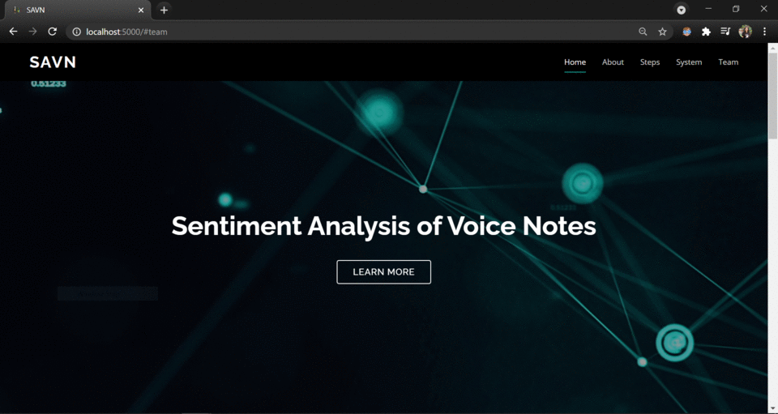

# **Sentiment Analysis of VoiceNotes (SAVN)**
The SAVN system consists of an Audio Based Sentiment Analysis (ABSA) model to analyze the sentiments being portrayed in a voice note which will be hosted on the AWS cloud service platform in order to provide individuals a reliable way of measuring the human quality of spoken conversations.

## **Table of Contents:**
1. <a href="#About">About</a>
2. <a href="#FS">Folder Structure</a>
3. <a href="#HIW">How it works?</a>
4. <a href="#Inst">Installation</a>
5. <a href="#AppRun">How to run the application?</a>
6. <a href="#WW">What's what?</a>
7. <a href="#Demo">Demonstration</a>
8. <a href="#Collab">Collaborators</a>
9. <a href="#References">References</a>

---

## <a name="About">**1. About**</a>
Voice notes are recorded by over hundreds of people everyday, all around the world. A voice note essentially is created by speaking into an electronic device. It can be used to deliver important and time-sensitive information or it can also be a recording of a conversation.  A system that analyses voice notes for their sentiments would be a reliable way of measuring the human quality of spoken conversations over a recording. This is where our SAVN system steps in.

## <a name="FS">**2. Folder Structure**</a>
```
SentimentAnalysisOfVoiceNotes
├───assets
│   ├───models
│   │   ├───audio_sentiment_model
│   └───pickles
├───sentiment_analysis
├───static
│   ├───css
│   ├───img
│   ├───js
│   ├───temp
│   └───vendor
├───templates
├───tests
└───uploads
```

## <a name="HIW">**3. How it works?**</a>
SAVN analyses the emotions being conveyed in an audio recording. The user will enter a MP3 audio file as an input to the system. The features of the input audio will be extracted. The audio features are then analysed by the ABSA model that generates a list of predicted sentiments. The predicted sentiments, along with its respective segmented audio file will be presented to the user as the output.

## <a name="Inst">**4. Installation**</a>

Clone the repository. Before installing the requirements, create a python or conda environment. This is an important step as the tensorflow version being used by this system (2.4.1) works only on Python 3.7 and not any of the later versions.

### **4.1 Creating a Python environment:**

Open your terminal and install the virtual environment tool with pip as follows :
```
pip install virtualenv
```
After the virtualenv has been installed, cd to the folder where you've saved this application from the terminal and run the following command to create a virtual environment :

```
cd path_to_folder
virtualenv -p python3.7.10 env_name
```

Activate your environment : 
```
env_name\Scripts\activate
```

### **4.2 Creating a conda environment :**

Open your Anaconda prompt (You can also use miniconda). Create a conda environment using the following command :
```
conda create -n env_name python=3.7.10 anaconda
```

After successfully creating your environment, activate it by running :
```
conda activate env_name
```


Once you have created an environment using either one of the above methods, install the application's requirements :
```
pip install -r requirements.txt
```

## <a name="AppRun">**5. How to run the application?**</a>
Open your terminal, activate your python/conda environment and run the [app.py](https://github.com/jendcruz22/SentimentAnalysisOfVoiceNotes/blob/main/app.py) file using the following command :
```
python app.py
```
or
```
flask run
```

## <a name="WW">**6. What's what?:**</a>
* This application has been created using Flask, Bootstrap, JQuery, and Ajax. 

* The [app.py](https://github.com/jendcruz22/SentimentAnalysisOfVoiceNotes/blob/main/app.py) file consists of the flask application. 

* This flask application uses various templates that are created using HTML and are stored in the [templates](https://github.com/jendcruz22/SentimentAnalysisOfVoiceNotes/tree/main/templates) folder.

* The [CSS](https://github.com/jendcruz22/SentimentAnalysisOfVoiceNotes/tree/main/static/css) and [JavaScript](https://github.com/jendcruz22/SentimentAnalysisOfVoiceNotes/tree/main/static/js) files used by the HTML templates are stored in the [static](https://github.com/jendcruz22/SentimentAnalysisOfVoiceNotes/tree/main/static) folder.

* The main page ie the [index.html](https://github.com/jendcruz22/DeepAudiobookTunerApp/blob/master/templates/index.html) file consists of the basic details of this application: How it works, about the system, about the team, etc.

* This application accepts mp3 audio files as input ([upload_file.html](https://github.com/jendcruz22/SentimentAnalysisOfVoiceNotes/blob/main/templates/sentimentanalysis.html)) which is saved in the [uploads folder](https://github.com/jendcruz22/SentimentAnalysisOfVoiceNotes/tree/main/uploads).  
* This audio is then segmented, processed and analysed by our ABSA model which in turn generates a list of predicted sentiments. 
* The segmented audio along with the predicted emotion for each audio segment is displayed as the output to the user. ([download.html](https://github.com/jendcruz22/SentimentAnalysisOfVoiceNotes/blob/main/templates/download.html))
* The [assets](https://github.com/jendcruz22/SentimentAnalysisOfVoiceNotes/tree/main/assets) and [sentimentanalysis](https://github.com/jendcruz22/SentimentAnalysisOfVoiceNotes/tree/main/sentiment_analysis) folders consist of the models used, the dependencies and other code that is used to run the application. 

## <a name="Demo">**7. Demonstration**</a>
Click on the GIF to watch the demonstration video.
[](https://www.youtube.com/watch?v=wqiLqmkHq-o)

## <a name="Collab">**8. Collaborators:**</a>
*   [Daniel Lobo](https://github.com/danlobo1999)
*   [Jenny Dcruz](https://github.com/jendcruz22)
*   [Smita Deulkar](https://github.com/smita3199)
*   [Leander Fernandes](https://github.com/fernandeslder)
                
---


## <a name="References">**8. References:**</a>
